<div align="center">

### 🚀 Trusted by 1,000+ Students &nbsp;|&nbsp; 4,000+ Print Orders Delivered

</div>

<div align="center">

[](https://git.io/typing-svg)


</div>

---

## 💬 Impact & Feedback

**Student Print Service** has made a real difference on campus — cutting queue times at the print shop, saving students hours every semester, and giving PSG Institute of Technology and Applied Research a faster, more organized way to handle printing.

<div align="center">

# 🔥 Hear It From the People Who Used It — Feedback From Our Students & Faculty ! 🔥

### 21 Anonymous Voices from Faculty & Students Who Lived the Difference 👇

</div>

<div align="center">
<table>
<tr>
<td width="50%" align="center">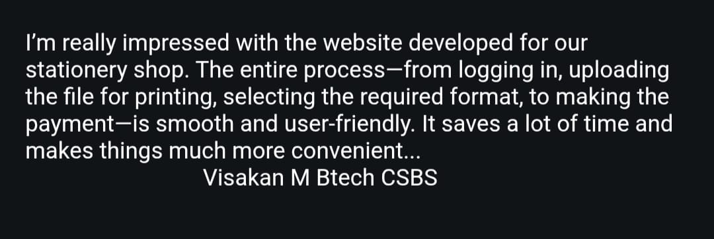</td>
<td width="50%" align="center">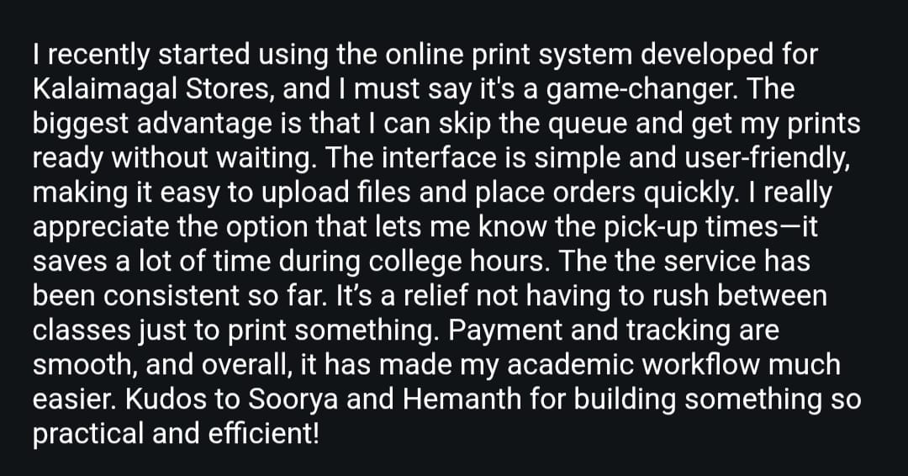</td>
</tr>
<tr>
<td width="50%" align="center">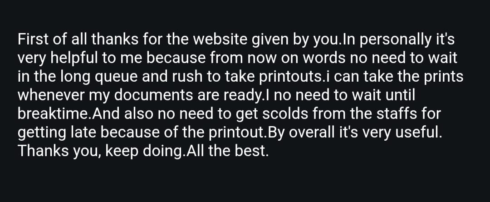</td>
<td width="50%" align="center">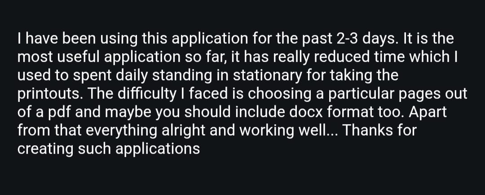</td>
</tr>
<tr>
<td width="50%" align="center">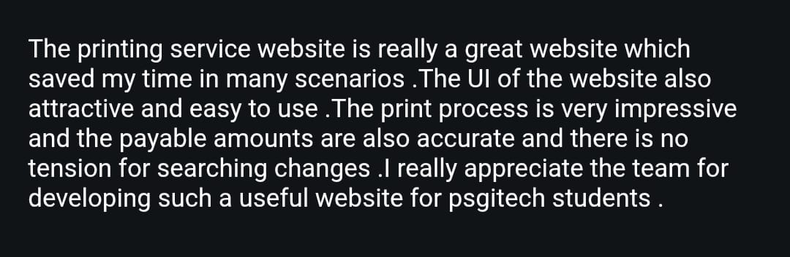</td>
<td width="50%" align="center">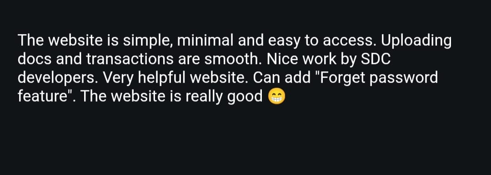</td>
</tr>
<tr>
<td width="50%" align="center">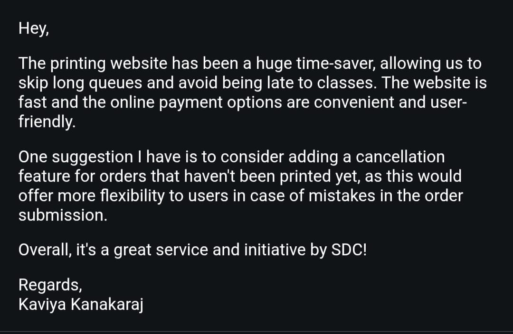</td>
<td width="50%" align="center">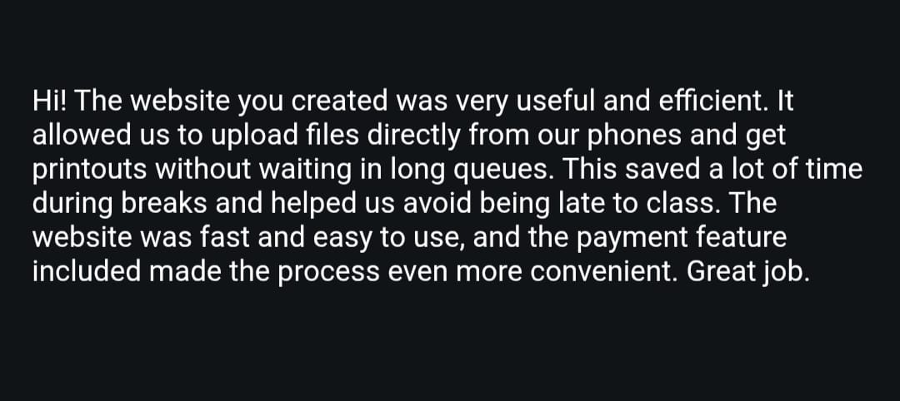</td>
</tr>
<tr>
<td width="50%" align="center">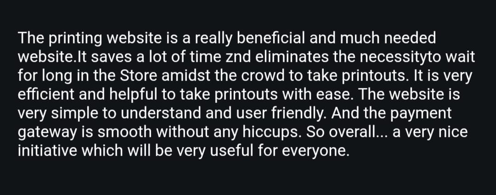</td>
<td width="50%" align="center">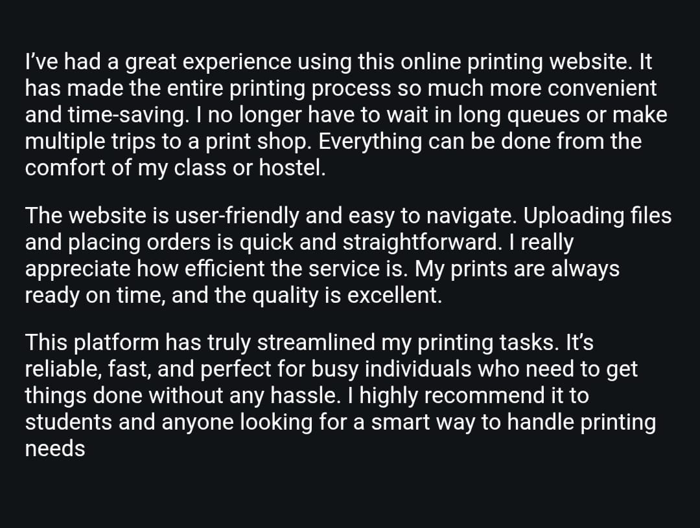</td>
</tr>
<tr>
<td width="50%" align="center">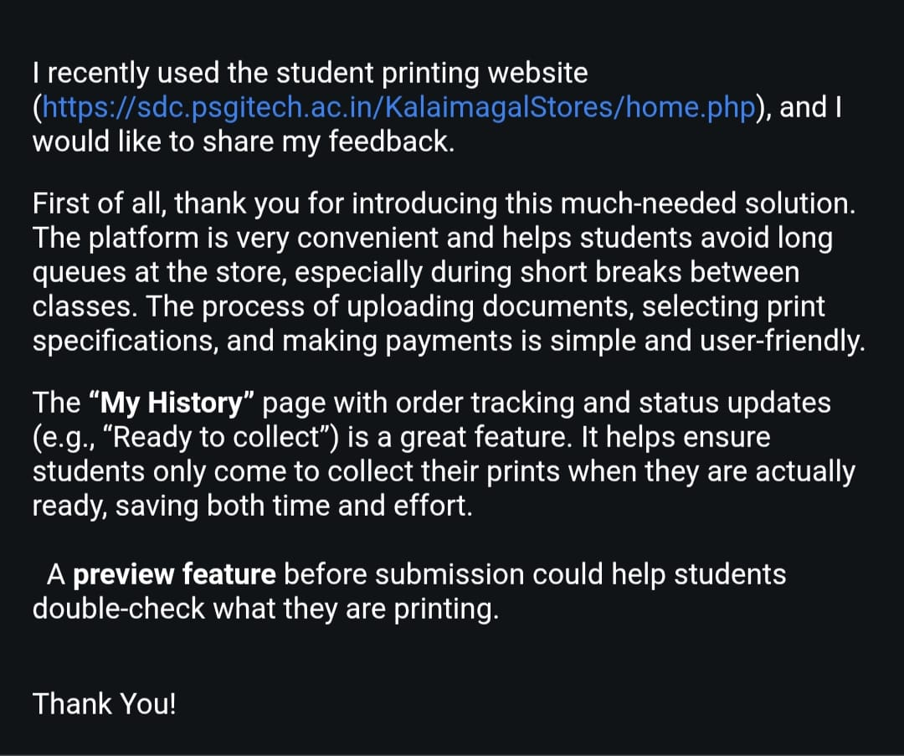</td>
<td width="50%" align="center">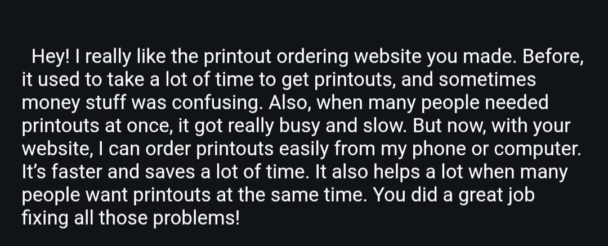</td>
</tr>
<tr>
<td width="50%" align="center">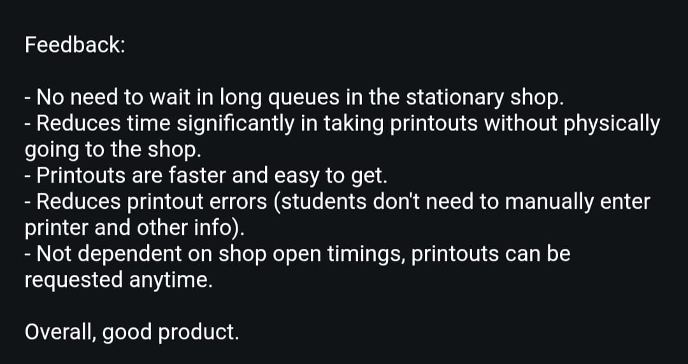</td>
<td width="50%" align="center">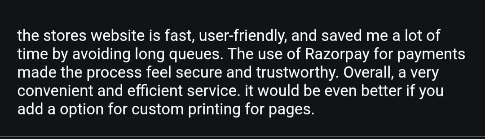</td>
</tr>
<tr>
<td width="50%" align="center">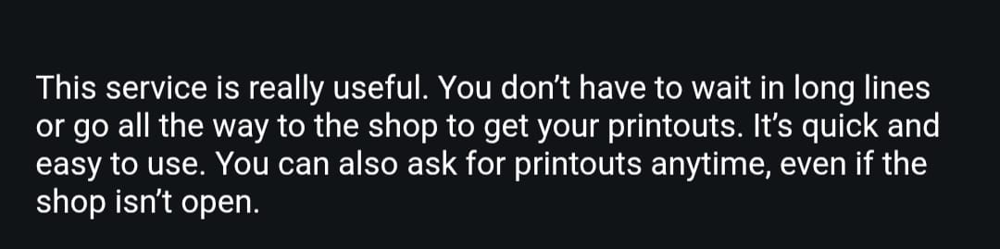</td>
<td width="50%" align="center">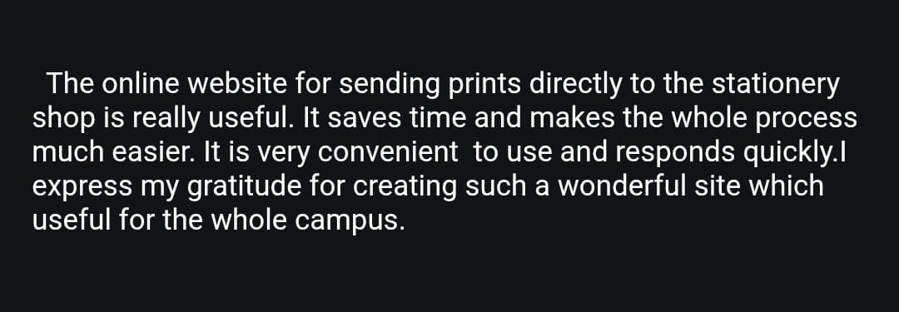</td>
</tr>
<tr>
<td width="50%" align="center">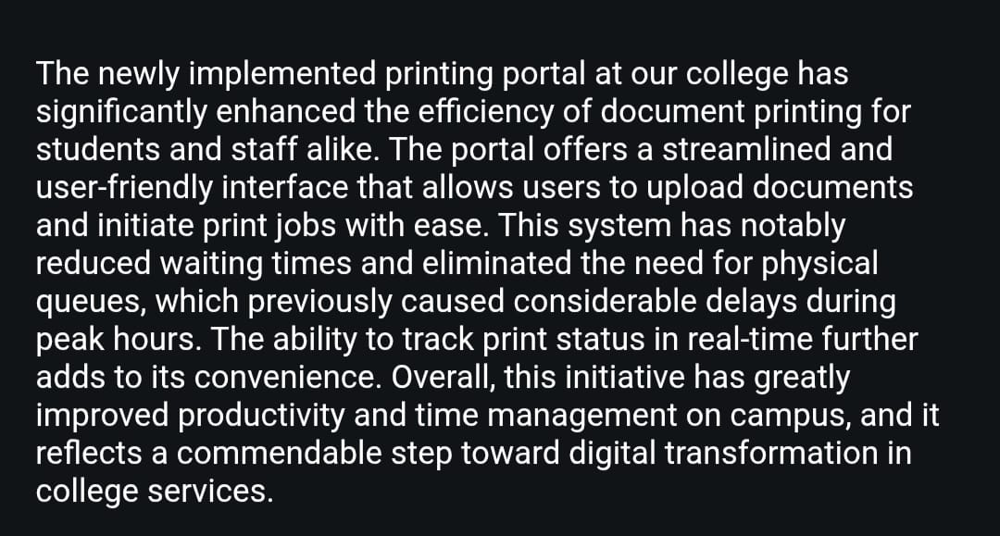</td>
<td width="50%" align="center">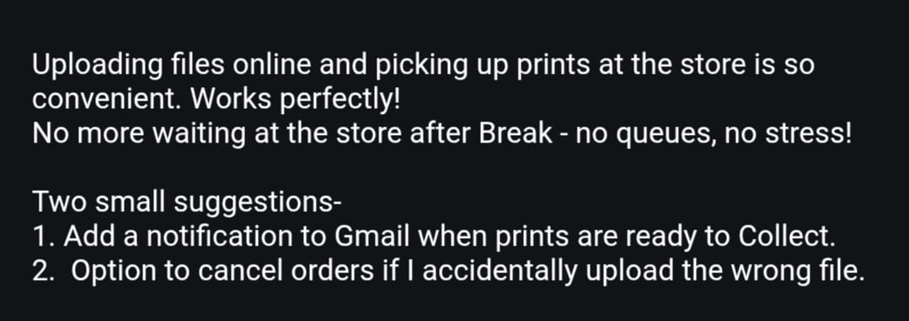</td>
</tr>
<tr>
<td width="50%" align="center">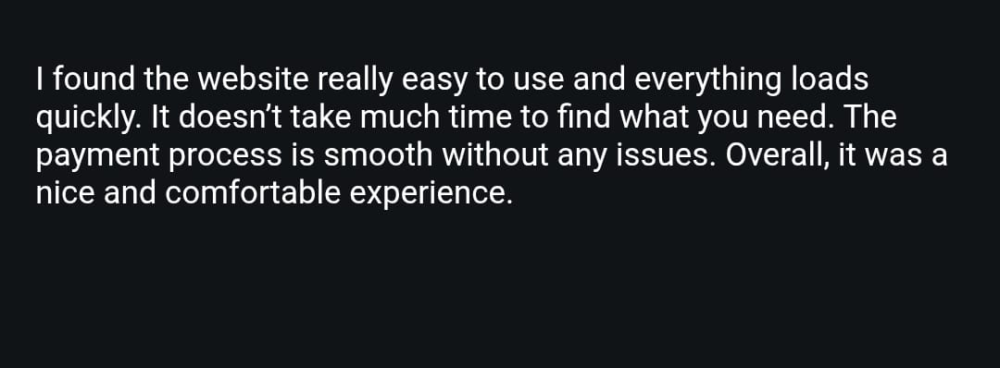</td>
<td width="50%" align="center">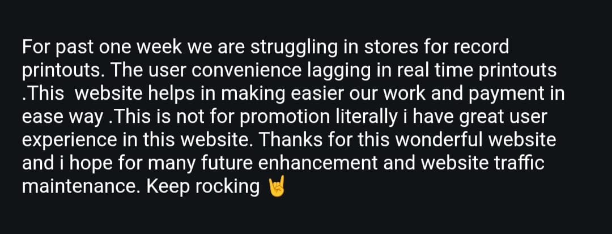</td>
</tr>
<tr>
<td width="50%" align="center">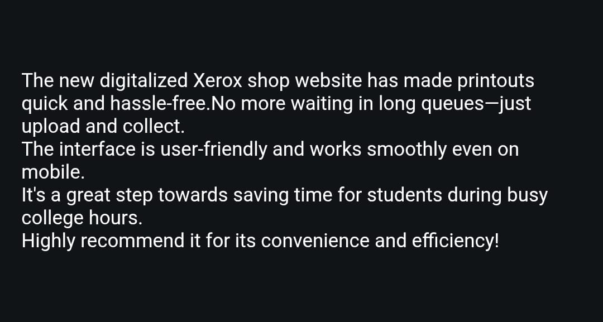</td>
<td width="50%"></td>
</tr>
</table>
</div>

---

## 📖 About the Project

**Student Print Service** is a full-stack web platform that digitizes the campus printing process at PSG Institute of Technology and Applied Research. Instead of physically queuing at the print shop, students upload their PDF documents online, configure print preferences (copies, color, paper size, orientation), pay securely through Razorpay, and track their order status in real time. Print shop staff manage every incoming request through a dedicated admin dashboard — accepting, rejecting, and fulfilling orders — with automated email notifications keeping students informed at each step.

Built by a 6-member team as part of the Software Development Cell (SDC), the platform has processed **4,000+ print orders for 1,000+ students**, significantly reducing wait times and crowding at campus printing centers.

---

## ✨ Key Features

| Feature | Description |
|---|---|
| 🔐 **Student Accounts** | Roll-number-based signup/login with hashed passwords |
| 📤 **PDF Upload & Configuration** | Upload multiple PDFs; choose copies, color, sides, orientation, paper type, and page ranges (all/odd/even/custom) |
| 💰 **Dynamic Cost Calculation** | Auto-calculates total cost based on page count, color, and copy settings |
| 💳 **Razorpay Payment Gateway** | Secure online payment before order confirmation |
| 📊 **Order History & Tracking** | Students can view past orders and live status (pending → processing → completed) |
| 🖥️ **Admin Dashboard** | Print shop staff review, accept, or reject incoming orders |
| 📧 **Automated Email Notifications** | Students are emailed when their order is accepted, rejected, or ready |
| 📈 **Daily Collection Report** | Admin view of orders collected each day |

---

## 🏗️ System Architecture

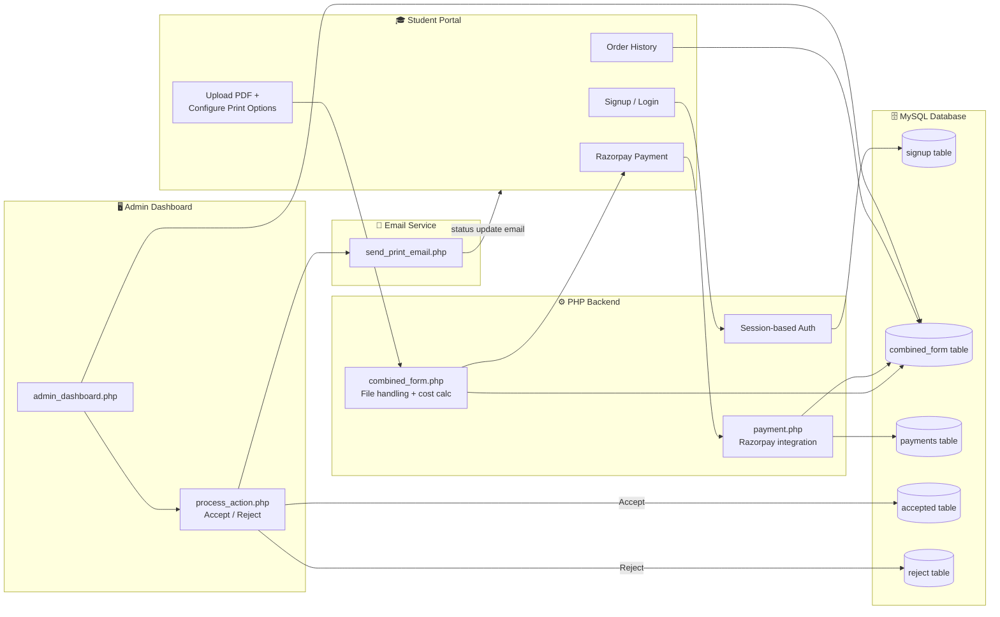

---

## 🔄 End-to-End Order Flow

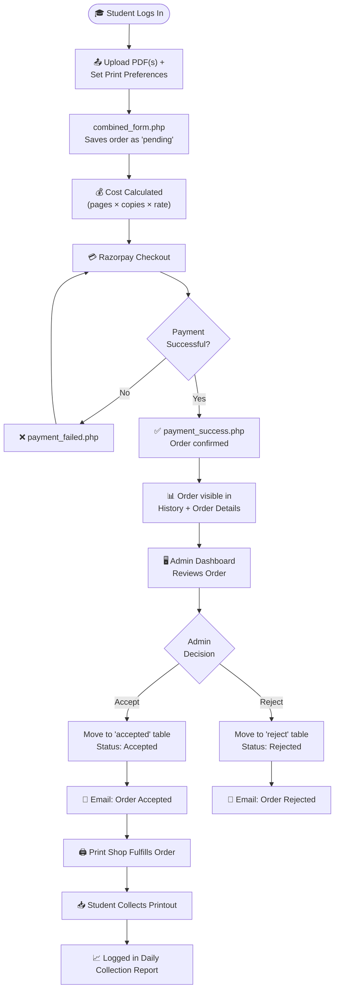

---

## 🗂️ Project Structure

```
Student-Print-Service/
├── login.php                 # Student login
├── signup.php                # Student registration (roll number based)
├── home.php                  # Student landing page
├── combined_form.php         # Print order form — upload + preferences + cost
├── combined_form.html        # Static version of the order form
├── payment.php               # Razorpay checkout + order/payment DB writes
├── payment_success.php       # Post-payment confirmation handler
├── payment_failed.php        # Failed payment handler
├── razorpay_webhook.php      # Razorpay server-side webhook listener
├── order.php                 # Individual order detail view
├── history.php               # Student's order history
├── student.php                # Student dashboard
├── download_file.php         # Secure file download handler
├── contactus.php             # Contact form
├── connection.php            # Root-level DB connection
├── navbar.php / navbar.html  # Shared navigation
├── uploads/                  # Uploaded student PDF files
├── admin/
│   ├── admin_login.php       # Admin authentication
│   ├── admin_dashboard.php   # Main order review dashboard
│   ├── admin_accept.php      # View of accepted orders
│   ├── admin_reject.php      # View of rejected orders
│   ├── process_action.php    # Accept/Reject order logic + email trigger
│   ├── send_email.php / send_print_email.php  # Email notification senders
│   ├── daily_collection.php  # Daily print collection report
│   ├── view_order.php        # Detailed order view for admin
│   ├── connection.php        # Admin-side DB connection
│   └── vendor/                # Composer dependencies (PHPMailer etc.)
└── FeedBacks/                 # Collected student feedback screenshots
```

---

## 🧩 Tech Stack

**Backend:** PHP (procedural), MySQLi (prepared statements)
**Database:** MySQL
**Frontend:** HTML5, CSS3, Bootstrap 5, vanilla JavaScript
**Payments:** Razorpay Checkout + Webhooks
**Email:** PHPMailer / SMTP (via Composer, see `admin/vendor`)
**Auth:** PHP Sessions + `password_hash()` / `password_verify()`

---

## 🔌 Core Pages & Responsibilities

| File | Role |
|---|---|
| `signup.php` / `login.php` | Student authentication (roll number + password) |
| `combined_form.php` | Handles PDF upload, print preferences, and creates the order record |
| `payment.php` | Calculates final cost, creates Razorpay order, records payment |
| `payment_success.php` / `payment_failed.php` | Post-payment redirect handlers |
| `razorpay_webhook.php` | Server-side payment verification via Razorpay webhook |
| `order.php` / `history.php` | Student-facing order tracking |
| `admin/admin_dashboard.php` | Lists all pending orders for review |
| `admin/process_action.php` | Accepts/rejects an order, moves it to `accepted`/`reject` table, and triggers email |
| `admin/daily_collection.php` | Report of orders collected on a given day |

---

## ⚙️ Getting Started

### Prerequisites
- PHP 7.4+ with `mysqli` extension enabled
- MySQL Server
- Composer (for email dependencies in `admin/vendor`)
- A Razorpay account (test/live API keys)

### 1. Clone the repository
```bash
git clone https://github.com/Soorya-SS-01/Student-Print-Service.git
cd Student-Print-Service
```

### 2. Set up the database
Create a MySQL database named `mydatabase`. Core tables used by the app include:
```sql
CREATE TABLE signup (
    id INT AUTO_INCREMENT PRIMARY KEY,
    username VARCHAR(20) NOT NULL UNIQUE,
    password VARCHAR(255) NOT NULL
);

CREATE TABLE combined_form (
    id INT AUTO_INCREMENT PRIMARY KEY,
    user_id INT,
    username VARCHAR(50),
    copies INT DEFAULT 1,
    pages VARCHAR(20),
    custom_pages VARCHAR(100),
    color TINYINT(1) DEFAULT 0,
    orientation VARCHAR(20),
    sides VARCHAR(20),
    paper_type VARCHAR(20),
    message TEXT,
    files TEXT,
    total_pages INT,
    total_cost DECIMAL(10,2),
    order_id VARCHAR(255),
    status VARCHAR(20) DEFAULT 'pending',
    created_at DATETIME,
    updated_at TIMESTAMP DEFAULT CURRENT_TIMESTAMP
);

CREATE TABLE payments (
    id INT AUTO_INCREMENT PRIMARY KEY,
    user_id INT,
    order_id VARCHAR(255),
    payment_id VARCHAR(255),
    amount DECIMAL(10,2),
    pages INT,
    copies INT,
    paper_type VARCHAR(20),
    orientation VARCHAR(20),
    sides VARCHAR(20),
    color TINYINT(1),
    page_option VARCHAR(20)
);

-- 'accepted' and 'reject' tables mirror combined_form's structure
-- with added accepted_at / rejected_at timestamps and payment_status.
```

### 3. Configure database credentials
Update the database connection details (`servername`, `username`, `password`, `database`) in `connection.php` and `admin/connection.php` to match your local MySQL setup.

### 4. Configure Razorpay & email
Add your Razorpay API keys in `payment.php` / `razorpay_webhook.php`, and your SMTP/email credentials in `admin/send_email.php` and `admin/send_print_email.php`.

### 5. Install PHP dependencies
```bash
cd admin
php composer.phar install
```

### 6. Run locally
Serve the project root through a local PHP environment (e.g. XAMPP/WAMP or the built-in PHP server):
```bash
php -S localhost:8000
```
Visit `http://localhost:8000/login.php` to get started.

---

## 👥 Team — Software Development Cell

- Abinaya Devadarshini D — 22CSE
- Sangamithra Saravanan — 22CSE
- **Soorya S S** — 23CSBS
- Karthika S — 22CSE
- Madhumitha — 22CSE
- Hemanth R — 23CSBS

<div align="center">

[GitHub](https://github.com/Soorya-SS-01) · [LinkedIn](https://www.linkedin.com/in/soorya-s-s-364839370)

</div>


